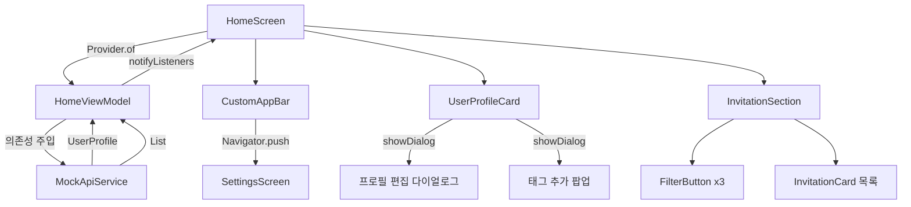

# 설계 문서: 홈 화면 인터랙션 (home-screen-interactions)

## 개요

Venture 앱의 홈 화면 UI 개선 및 인터랙션 구현 스펙입니다.
현재 기능이 없는 버튼들에 실제 동작을 연결하고, 데이터 모델을 개선하며, 목업 API 레이어를 도입합니다.

주요 변경 사항:
- AppBar 설정 버튼 → SettingsScreen 네비게이션
- 프로필 편집 다이얼로그 (이름/사진 수정)
- 태그 추가/삭제 기능
- 페이지 인디케이터 제거
- InvitationSection 필터 버튼 방식으로 개편
- InvitationCard 이미지 카드 형태로 변경
- Invitation 모델 확장
- BottomActionArea 제거
- MockApiService 도입

---

## 아키텍처

### 전체 구조

Feature-first MVVM 패턴을 유지합니다. Provider를 통해 ViewModel이 View에 상태를 제공하고, MockApiService는 ViewModel에 주입됩니다.

```
lib/
├── core/
│   ├── models/
│   │   └── user_profile.dart         # UserProfile (mutable 필드 추가)
│   └── services/
│       └── mock_api_service.dart     # MockApiService (신규)
└── features/
    ├── home/
    │   ├── models/
    │   │   └── invitation.dart       # Invitation + InvitationType (변경)
    │   ├── viewmodels/
    │   │   └── home_view_model.dart  # HomeViewModel (변경)
    │   └── views/
    │       ├── home_screen.dart      # HomeScreen (변경)
    │       └── home_screen_widgets.dart # 위젯들 (변경)
    └── settings/
        └── views/
            └── settings_screen.dart  # SettingsScreen (신규)
```

### 데이터 흐름



---

## 컴포넌트 및 인터페이스

### MockApiService

`lib/core/services/mock_api_service.dart`에 신규 생성합니다.
실제 HTTP 클라이언트 없이 Future를 반환하여 비동기 API 패턴을 모방합니다.

```dart
class MockApiService {
  Future<UserProfile> getMe();
  Future<UserProfile> patchMe({String? name, String? profileImageUrl, List<String>? interests, String? ageRange, String? gender});
  Future<List<Invitation>> getInvitations();
  Future<Map<String, dynamic>> getSettings();
}
```

### HomeViewModel

MockApiService를 생성자 주입으로 받습니다. 필터 상태는 `InvitationType?`으로 관리합니다 (null = 전체 표시).

```dart
class HomeViewModel extends ChangeNotifier {
  final MockApiService _apiService;
  UserProfile? _currentUser;
  List<Invitation> _invitations;
  InvitationType? _activeFilter;   // null이면 전체 표시
  int _currentPageIndex;

  // 필터링된 초대장 목록 (정렬 포함)
  List<Invitation> get filteredInvitations;

  // 프로필 편집
  Future<void> updateProfile({String? name, String? profileImageUrl});

  // 태그 관리
  void removeTag(String tagValue, TagType type);
  Future<void> addTag(String tagValue, TagType type);

  // 필터
  void toggleFilter(InvitationType type);
}
```

**설계 결정**: `selectedTabIndex` → `activeFilter(InvitationType?)`로 교체합니다. 탭바에서 토글 필터 버튼으로 UI가 바뀌므로 단일 선택 인덱스 대신 nullable enum이 더 적합합니다.

### CustomAppBar

`onSettingsTap` 콜백 대신 `BuildContext`를 받아 내부에서 `Navigator.push`를 호출합니다.

```dart
class CustomAppBar extends StatelessWidget implements PreferredSizeWidget {
  // AppBar를 상속하는 대신 StatelessWidget으로 변경
  // Navigator.push(context, MaterialPageRoute(builder: (_) => SettingsScreen()))
}
```

**설계 결정**: 기존 `CustomAppBar extends AppBar`는 `BuildContext`에 접근하기 어렵습니다. `StatelessWidget implements PreferredSizeWidget`으로 변경하여 context를 활용합니다.

### UserProfileCard

태그 렌더링 방식을 변경합니다.

- `UserProfileTag`: X 버튼 포함, `onDelete` 콜백 추가
- "+" 버튼: 태그 목록 마지막에 추가
- 페이지 인디케이터 Row 제거

```dart
class UserProfileTag extends StatelessWidget {
  final String text;
  final VoidCallback onDelete;
}
```

### 태그 추가 팝업 (AddTagDialog)

`showDialog`로 표시하는 StatefulWidget 다이얼로그입니다.

```dart
// TagType enum
enum TagType { interest, ageRange, gender }

class AddTagDialog extends StatefulWidget {
  // DropdownButton으로 TagType 선택
  // TextField로 값 입력
  // 유효성 검사: 빈 값 방지
}
```

### InvitationSection

탭바를 제거하고 FilterButton 3개로 교체합니다.

```dart
class InvitationSection extends StatelessWidget {
  // FilterButton(label: '새 초대장', type: InvitationType.newInvitation)
  // FilterButton(label: '장기 모임', type: InvitationType.longTerm)
  // FilterButton(label: '만료된 초대장', type: InvitationType.expired)
}

class FilterButton extends StatelessWidget {
  final String label;
  final InvitationType type;
  final bool isSelected;
  final VoidCallback onTap;
  // borderRadius: 20, 선택 시 메인 컬러(#D6706D) 배경
}
```

### InvitationCard

이미지 카드 형태로 전면 개편합니다.

```dart
class InvitationCard extends StatelessWidget {
  final Invitation invitation;
  // 상단: ClipRRect로 이미지 (imageUrl null이면 Container 플레이스홀더)
  // 하단: title, dateTime(포맷), location, memberCount
}
```

날짜 포맷: `intl` 패키지 없이 수동 포맷 사용 (`'${dt.year}년 ${dt.month}월 ${dt.day}일 ${dt.hour.toString().padLeft(2,'0')}:${dt.minute.toString().padLeft(2,'0')}'`)

### SettingsScreen

플레이스홀더 화면입니다.

```dart
class SettingsScreen extends StatelessWidget {
  // Scaffold + AppBar(title: '설정', leading: BackButton)
  // body: Center(child: Text('설정 화면'))
}
```

---

## 데이터 모델

### Invitation (변경)

```dart
enum InvitationType { newInvitation, longTerm, expired }

class Invitation {
  final String id;
  final InvitationType type;
  final String title;
  final DateTime dateTime;
  final String location;
  final String? imageUrl;
  final int memberCount;
}
```

기존 `description`, `isNew`, `isRegular` 필드는 제거됩니다.
정렬 순서: `newInvitation(0) → longTerm(1) → expired(2)` (type의 index 기준).

### UserProfile (변경)

태그 추가/삭제를 위해 `interests`, `ageRange`, `gender`를 mutable하게 변경합니다.

```dart
class UserProfile {
  String name;
  String profileImageUrl;
  List<String> interests;   // final → mutable
  String ageRange;          // final → mutable
  String gender;            // final → mutable
  final double rating;

  // copyWith 메서드 추가
  UserProfile copyWith({...});
}
```

**설계 결정**: `final` 필드를 직접 변경하는 대신 `copyWith`를 사용하여 ViewModel에서 새 인스턴스를 할당합니다. 이는 불변성을 유지하면서도 상태 변경을 명확하게 합니다.

### TagType (신규)

```dart
enum TagType { interest, ageRange, gender }
```

태그 추가 팝업에서 어떤 필드에 추가할지 구분하는 데 사용합니다.

---

## 정확성 속성 (Correctness Properties)

*속성(Property)이란 시스템의 모든 유효한 실행에서 참이어야 하는 특성 또는 동작입니다. 즉, 시스템이 무엇을 해야 하는지에 대한 형식적 명세입니다. 속성은 사람이 읽을 수 있는 명세와 기계가 검증할 수 있는 정확성 보장 사이의 다리 역할을 합니다.*

### 속성 1: 태그 삭제 후 목록에서 제거됨

*임의의* UserProfile과 해당 프로필에 존재하는 임의의 태그에 대해, 해당 태그를 삭제하면 프로필의 태그 목록에서 해당 값이 더 이상 존재하지 않아야 한다.

**검증 대상: 요구사항 3.2**

### 속성 2: 태그 추가 후 목록에 포함됨

*임의의* UserProfile과 임의의 유효한(비어있지 않은) 태그 값 및 TagType에 대해, 해당 태그를 추가하면 프로필의 해당 필드 목록에 그 값이 포함되어야 한다.

**검증 대상: 요구사항 4.2**

### 속성 3: 빈 값 입력은 거부됨

*임의의* 공백 문자로만 구성된 문자열에 대해, 태그 값 또는 프로필 이름으로 저장을 시도하면 거부되어야 하고 기존 상태는 변경되지 않아야 한다.

**검증 대상: 요구사항 2.4, 4.3**

### 속성 4: 다이얼로그/팝업 취소 시 상태 불변

*임의의* UserProfile 상태에서 편집 다이얼로그 또는 태그 추가 팝업을 열고 취소하면, ViewModel의 상태는 팝업을 열기 전과 동일해야 한다.

**검증 대상: 요구사항 2.3, 4.4**

### 속성 5: 이름 업데이트 반영

*임의의* 유효한(비어있지 않은) 이름 문자열에 대해, updateProfile을 호출하면 ViewModel의 currentUser.name이 해당 값과 일치해야 한다.

**검증 대상: 요구사항 2.2**

### 속성 6: 필터 적용 시 해당 타입만 반환됨

*임의의* Invitation 목록과 임의의 InvitationType 필터에 대해, 필터를 활성화하면 filteredInvitations의 모든 항목은 해당 type을 가져야 한다.

**검증 대상: 요구사항 6.5**

### 속성 7: 필터 토글 라운드 트립

*임의의* Invitation 목록에 대해, 필터를 활성화한 후 동일한 필터를 다시 탭하면 filteredInvitations는 전체 목록과 동일해야 한다. 또한 아무 필터도 선택되지 않은 초기 상태에서도 전체 목록이 반환되어야 한다.

**검증 대상: 요구사항 6.4, 6.6**

### 속성 8: 초대장 목록 정렬 순서 불변

*임의의* Invitation 목록에 대해, filteredInvitations는 항상 newInvitation → longTerm → expired 순서로 정렬되어야 한다 (type.index 오름차순).

**검증 대상: 요구사항 6.7**

### 속성 9: 초대장 카드 필수 정보 표시

*임의의* Invitation 객체에 대해, InvitationCard를 렌더링하면 title, 포맷된 dateTime, location, memberCount가 모두 화면에 표시되어야 한다.

**검증 대상: 요구사항 7.2, 7.4, 7.5**

### 속성 10: 날짜 포맷 형식 준수

*임의의* DateTime 값에 대해, 포맷 함수는 "yyyy년 MM월 dd일 HH:mm" 형식의 문자열을 반환해야 한다. 즉, 연도 4자리, 월, 일, 시(2자리 패딩), 분(2자리 패딩)이 올바르게 포함되어야 한다.

**검증 대상: 요구사항 7.3**

### 속성 11: MockAPI 프로필 수정 라운드 트립

*임의의* 유효한 프로필 수정 데이터(이름, 사진 URL, 태그 목록)에 대해, patchMe를 호출한 후 getMe를 호출하면 수정된 데이터와 동일한 UserProfile을 반환해야 한다.

**검증 대상: 요구사항 10.2**

---

## 오류 처리

### 유효성 검사 오류

| 상황 | 처리 방식 |
|------|-----------|
| 프로필 이름이 비어있음 | 다이얼로그 내 오류 텍스트 표시 ("이름을 입력해주세요") |
| 태그 값이 비어있음 | 팝업 내 오류 텍스트 표시 ("태그 값을 입력해주세요") |

### 이미지 로드 오류

- `imageUrl`이 null이거나 로드 실패 시: 플레이스홀더 컨테이너(회색 배경 + 아이콘) 표시
- `profileImageUrl` 로드 실패 시: `CircleAvatar`의 `onBackgroundImageError` 콜백으로 기본 아이콘 표시

### MockApiService 오류

- 현재 목업 구현에서는 오류가 발생하지 않으나, `Future`를 반환하는 인터페이스를 유지하여 실제 API 전환 시 `try-catch` 패턴을 적용할 수 있도록 합니다.
- ViewModel에서 `_isLoading` 상태를 관리하여 로딩 중 UI를 표시합니다.

---

## 테스트 전략

### 이중 테스트 접근법

단위 테스트와 속성 기반 테스트를 함께 사용합니다. 단위 테스트는 구체적인 예시와 엣지 케이스를 검증하고, 속성 기반 테스트는 임의의 입력에 대한 보편적 속성을 검증합니다.

### 단위 테스트

`test` 패키지를 사용합니다.

- **HomeViewModel 테스트**
  - `removeTag`: 특정 태그 삭제 후 목록에서 제거 확인
  - `addTag`: 유효한 태그 추가 후 목록에 포함 확인
  - `toggleFilter`: 필터 활성화/비활성화 상태 전환 확인
  - `filteredInvitations`: 필터 없을 때 전체 반환, 필터 있을 때 해당 타입만 반환
  - `updateProfile`: 이름 업데이트 후 currentUser 반영 확인

- **MockApiService 테스트**
  - `getMe`: UserProfile 반환 확인
  - `patchMe`: 변경된 필드 반영 확인
  - `getInvitations`: Invitation 목록 반환 확인

- **위젯 테스트**
  - `CustomAppBar`: 설정 버튼 탭 시 SettingsScreen으로 이동 확인
  - `UserProfileTag`: X 버튼 탭 시 onDelete 콜백 호출 확인
  - `FilterButton`: 선택/비선택 상태 시각적 차이 확인
  - `InvitationCard`: imageUrl null 시 플레이스홀더 표시 확인

### 속성 기반 테스트

`dart_test` + `fast_check` 패키지 (또는 `glados` 패키지)를 사용합니다. 각 테스트는 최소 100회 반복 실행합니다.

각 속성 테스트는 설계 문서의 속성을 참조하는 주석을 포함합니다:
`// Feature: home-screen-interactions, Property N: <속성 설명>`

| 속성 | 테스트 내용 |
|------|-------------|
| 속성 1 | 임의의 태그 목록에서 임의의 태그 삭제 후 해당 값 부재 확인 |
| 속성 2 | 임의의 유효 태그 값과 TagType 추가 후 해당 필드 목록 포함 확인 |
| 속성 3 | 임의의 공백 문자열로 태그/이름 저장 시도 시 거부 및 상태 불변 확인 |
| 속성 4 | 임의의 상태에서 다이얼로그/팝업 취소 후 상태 불변 확인 |
| 속성 5 | 임의의 유효 이름으로 updateProfile 후 currentUser.name 일치 확인 |
| 속성 6 | 임의의 Invitation 목록에 필터 적용 시 결과 타입 일치 확인 |
| 속성 7 | 임의의 Invitation 목록에 필터 활성화 후 해제 시 전체 복원 확인 |
| 속성 8 | 임의의 Invitation 목록 정렬 후 순서 불변 확인 |
| 속성 9 | 임의의 Invitation 렌더링 시 title/location/memberCount 포함 확인 |
| 속성 10 | 임의의 DateTime 포맷 결과 형식 검증 |
| 속성 11 | 임의의 수정 데이터로 patchMe 후 getMe 라운드 트립 확인 |
